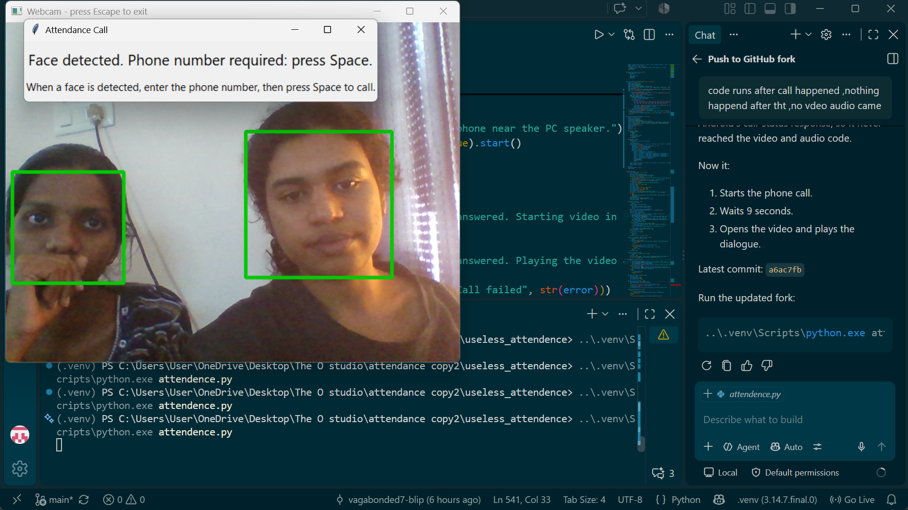
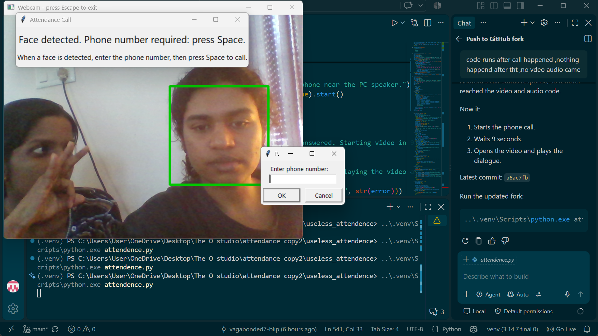
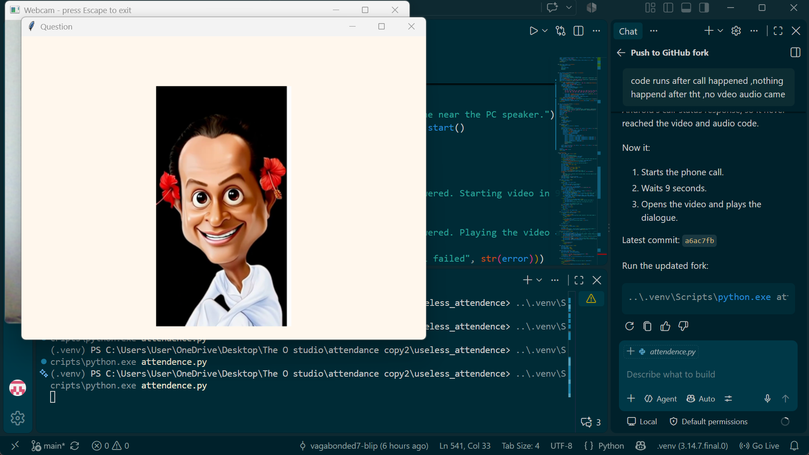
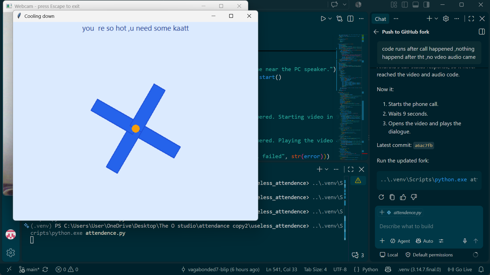
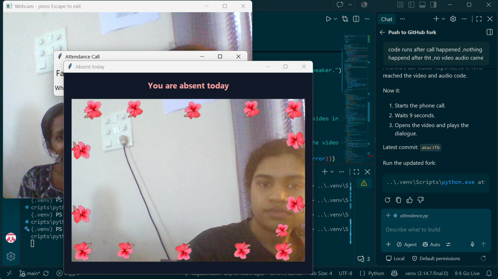
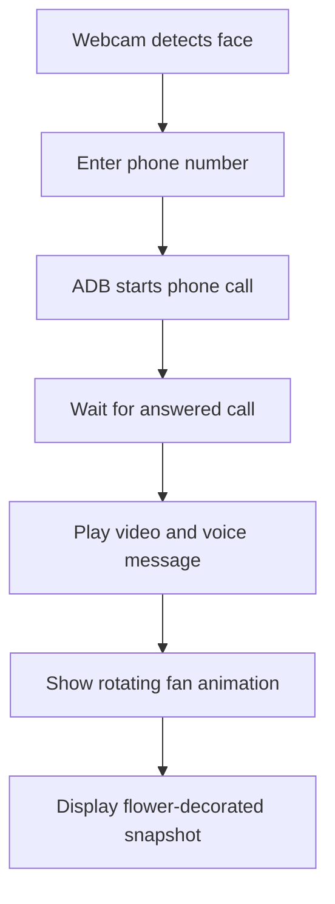

# Useless Attendance System 🎯


## Basic Details
### Team Name: The Attendance Avengers


### Team Members
- Member 1: Swathi Lakshmi O - College of Engineering Vadakara
- Member 2: Nandana P - College of Engineering Vadakara

### Project Description
A humorous face-recognition attendance system that detects a person, initiates an attendance call through an Android phone, plays a video and voice message, captures a snapshot, and decorates it with flowers.

### The Problem (that doesn't exist)
No one takes a snap of us while we register attendance.

### The Solution (that nobody asked for)
The system detects a face, starts an attendance call through an Android phone, plays a funny video and voice message, then captures a flower-decorated snapshot as proof of attendance.

## Technical Details
### Technologies/Components Used
For Software:
- Python
- Tkinter desktop UI
- OpenCV, Pillow
- Android Debug Bridge (ADB)

For Hardware:
- Windows PC with webcam and speakers
- Android phone with USB debugging enabled
- USB cable and bundled ADB platform tools

### Implementation
For Software:
# Installation
This project uses a webcam, Windows audio playback, and Android Debug Bridge (ADB), so it runs locally on a Windows computer rather than on a cloud web server.

Clone the repository:

```powershell
git clone https://github.com/vagabonded7-blip/useless_attendence.git
cd useless_attendence
```

Create and activate a virtual environment, then install the dependencies:

```powershell
py -m venv .venv
.\.venv\Scripts\Activate.ps1
python -m pip install -r requirements.txt
```

Connect an Android phone with USB debugging enabled and confirm ADB can detect it:

```powershell
.\platform-tools\adb.exe devices
```

Accept the USB debugging authorization prompt on the phone. Make sure the webcam is available before starting the app.

# Run
```powershell
python attendence.py
```

The app starts a real phone call after a face is detected and a phone number is entered, so use a test number when trying it.

### Project Documentation
For Software:

# Screenshots
The following screenshots document the application workflow. Runtime attendance photos remain local in the ignored `snapshots/` folder.











# Diagrams


For Hardware:

# Schematic & Circuit
# Build Photos

The main build is software-based and uses a webcam, Windows PC, Android phone, USB cable, and speakers.

### Project Demo
# Video
The demo video is included in the repository as `pappuvideo.mp4`.

## Team Contributions
- Swathi Lakshmi O: Face detection, attendance workflow, and integration testing.
- Nandana P: User experience, media assets, snapshot presentation, and documentation.

---
Made with ❤️ at TinkerHub Useless Projects 


